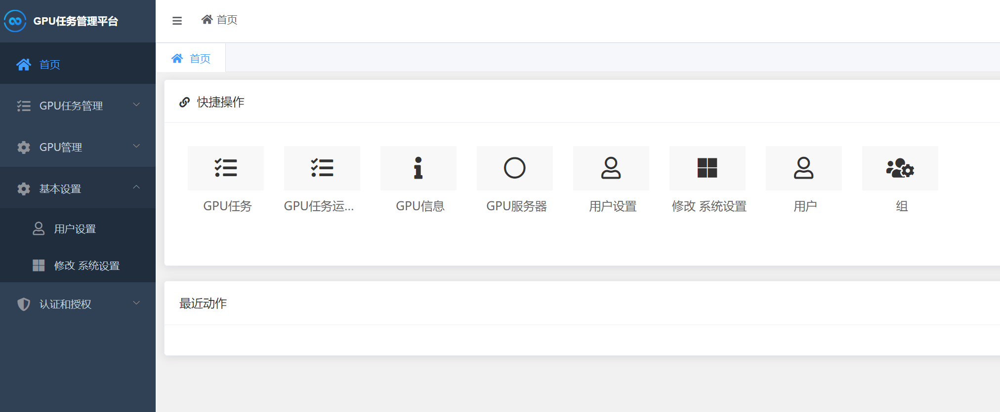
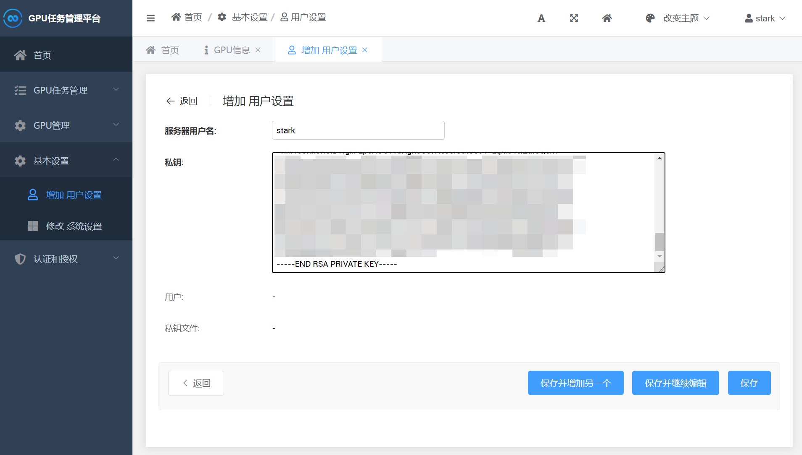
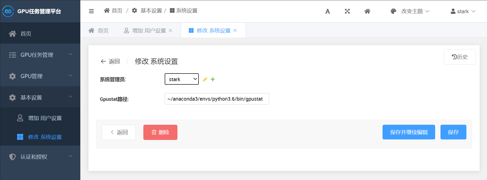
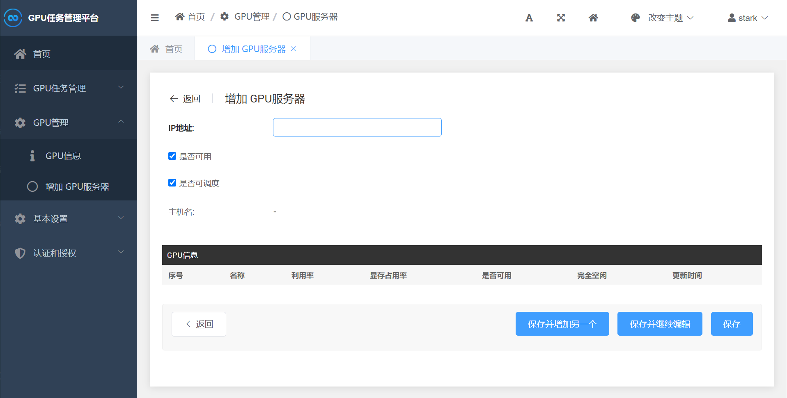
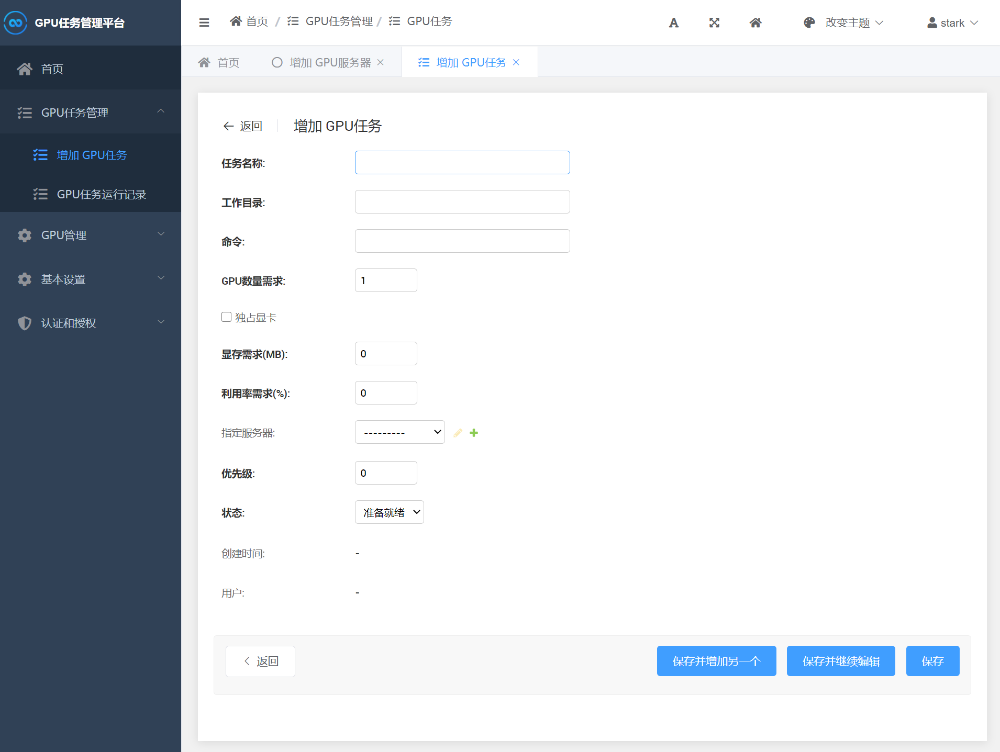

# GPU Tasker

轻量好用的GPU机群任务调度工具

[](https://github.com/newpanjing/simpleui)

## 介绍

GPU Tasker是一款GPU任务调度工具，适用于GPU机群或单机环境，科学地调度每一项任务，深度学习工作者的福音。

**警告：不建议将本工具用于实验室抢占GPU，这将会使你的同学或师兄盯上你（狗头）**

## 开始使用

### 环境准备

在机群环境下，将GPU Tasker安装在机群环境下的一台服务器或PC，安装GPU Tasker的服务器成为Master，其余服务器称为Node，Master可以通过ssh连接所有Node服务器。**建议Node服务器连接NAS或拥有共享目录，并连接LDAP。**

* Master

安装django、django-simpleui

```shell
pip install django django-simpleui
```

* Node

安装gpustat（所有Node服务器安装在相同位置或NAS目录下。暂不支持每个服务器自定义gpustat路径，后续版本迭代可能会支持。）

```shell
pip install gpustat
which gpustat  # 查看gpustat路径，稍后会使用
```

### 部署GPU Tasker

由于开发时间有限，尚未支持一键部署，后续版本迭代会逐步支持。部署环节建议有django基础

* 在Master服务器clone本项目

```shell
git clone https://github.com/cnstark/gputasker.git
cd gputasker
```

* 编辑`gpu_tasker/settings.py`，编辑数据库等django基本设置，如果是单用户使用或机群规模较小时（或者服务器安装MySQL困难），使用sqlite即可。

* 初始化项目数据库

```shell
python manage.py makemigrations
python manage.py migrate
```

* 创建超级用户

```shell
python manage.py createsuperuser
```

根据提示输入信息，完成创建。

* 启动服务

```shell
python manage.py runserver 0:8888
```

* 基本设置

访问`http://your_server:8888/admin`，登录管理后台。



添加`用户设置`，输入服务器用户名与私钥。Master通过私钥登录Node服务器，需要将私钥添加至Node服务器`authorized_keys`。

暂只支持每个服务器使用相同的用户名，后续版本迭代可能会支持。



添加`系统设置`，选择系统管理员，填写gpustat路径。GPU Tasker会使用系统管理员的用户登录Node服务器，执行gpustat获取GPU状态，因此系统管理员用户需要与安装gpustat的用户一致。



* 启动主进程

```shell
python main.py
```

### 添加Node节点

点击`GPU服务器`，添加Node节点ip或域名，点击保存。保存后会自动更新node节点信息，包括hostname以及GPU信息



选项说明

* 是否可用：服务器当前状态是否可用。若连接失败或无法获取GPU状态则会被自动置为False并不再被调度。
* 是否可调度：服务器是否参与任务调度。若服务器有其他用途（被人独占等），手动设置此项为False，该服务器不再被调度。

### 添加任务

点击`GPU任务`，输入任务信息并保存。状态为`准备就绪`的任务会在服务器满足需求时执行。



选项说明

* 工作目录：执行命令时所在的工作目录。
* 命令：执行的命令。如果需要执行多条命令，请用`&&`连接，如：

```shell
source venv/pytorch/bin/activate && python train.py
```

* GPU数量需求：任务所需的GPU数量。当任务被调度时，会根据所需GPU数量自动设置`CUDA_VISIBLE_DEVICES`环境变量，因此任务命令中不要手动设置`CUDA_VISIBLE_DEVICES`，避免调度失败。
* 独占显卡：当该选项为True时，只会调度没有进程占用的显卡。
* 显存需求：任务在单GPU上需要的显存。设置时保证任务可以运行即可，不需要准确。
* 利用率需求：任务在单GPU上需要的空闲利用率。

注意：显存需求和利用率需求只在`独占显卡`为False时生效，当GPU满足显存需求和利用率时会参与调度。仅用于GPU全被占满需要强占的情况，一般情况下建议勾选`独占显卡`。

* 指定服务器：选择任务运行的服务器。若该选项为空，则在所有可调度服务器中寻找满足需求的服务器；否则只在指定服务器上等待GPU满足条件时调度。

* 优先级：任务调度的优先级。功能尚未支持。
* 状态：当前任务状态。状态为`准备就绪`时，任务会被调度。

任务运行后可以通过`GPU任务运行记录`查看任务状态与Log。

## 通知设置

GPUTasker支持邮件通知，任务开始运行和结束时向用户发送邮件提醒。

### 开启邮箱SMTP功能

进入邮箱后台，开启SMTP功能，并获取SMTP密钥。不同邮件服务商配置方式不同，具体开启方法参考邮箱帮助。

### 配置邮件通知

复制`email_settings_sample.py`为`email_settings.py`。

```shell
cd gpu_tasker
cp email_settings_sample.py email_settings.py
```

编辑`email_settings.py`，填写SMTP服务器、端口、邮箱名和密码：

```python
# 以163邮箱为例

EMAIL_BACKEND = 'django.core.mail.backends.smtp.EmailBackend'
# SMTP服务器
EMAIL_HOST = 'smtp.163.com'
# SMTP服务器端口
EMAIL_PORT = 465

# 邮箱名
EMAIL_HOST_USER = 'xxx@163.com'
# SMTP密钥（部分邮箱与邮箱密码相同）
EMAIL_HOST_PASSWORD = 'xxx'

EMAIL_USE_SSL = True
EMAIL_USE_LOCALTIME = True
DEFAULT_FROM_EMAIL = 'GPUTasker<{}>'.format(EMAIL_HOST_USER)
SERVER_EMAIL = EMAIL_HOST_USER
```

### 配置收信邮箱

收信邮箱为Django用户`电子邮件地址`，在后台进行配置。


## QQ交流群

* 群号：634800826


## 写在后面

在一次急需跑一个程序却在实验室几十台服务器上找不到一块显卡时萌生了这个想法，花半天时间写了这个项目的第一版，在显卡空闲时“抢”显卡执行我的程序，当时就决定开源，造福像我一样抢不到显卡的人。使用过程中经过了几天的完善，逐渐变成了一个支持多用户的GPU的任务调度工具，也更希望任务可以被有序调度而不是所有人疯狂的抢，这也是项目未来的愿景。

由于项目开发比较仓促，存在很多不完善的地方。如果在使用过程中有任何意见或建议，请提交issue或者pr。让我们共同完善这个新生的项目。

## 致谢

感谢[simpleui](https://github.com/newpanjing/simpleui)团队开发的强大工具。
